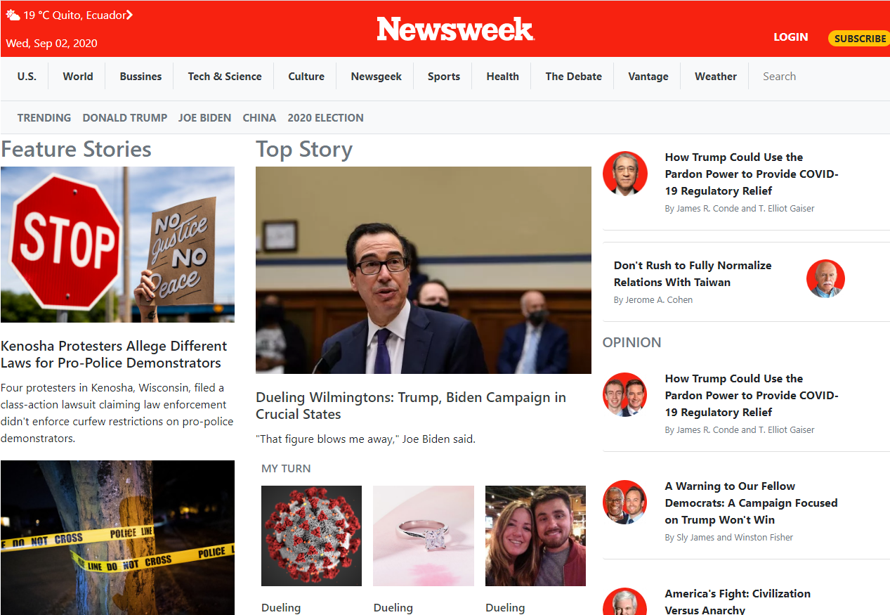

# Using Bootstrap

> A clone of the 'Newsweek' website , all Javascript features will be omitted.

https://newsweek.com/

## Built With

- HTML5 / CSS3
- Bootstrap

## Live Demo

[Live Demo Link](https://len23.github.io/news-week-bootstrap/)

## Getting Started

The project is public.

## Authors

👤 **Mauricio Tabilo**

- Github: [@Nexch](https://github.com/Nexch)
- Twitter: [@@MfinchT](https://twitter.com/MfinchT)
- Linkedin: [linkedin](https://www.linkedin.com/in/Nexch)

👤 **Lenin Montalvo**
- Github: [@len23](https://github.com/len23)
- Twitter: [@lenon468](https://twitter.com/lenon468)
- LinkedIn: [Lenin Montalvo](https://www.linkedin.com/in/lenin-montalvo-77660b1b2/)

## 🤝 Contributing

Contributions, issues and feature requests are welcome!

## Show your support

Give a ⭐️ if you like this project!

